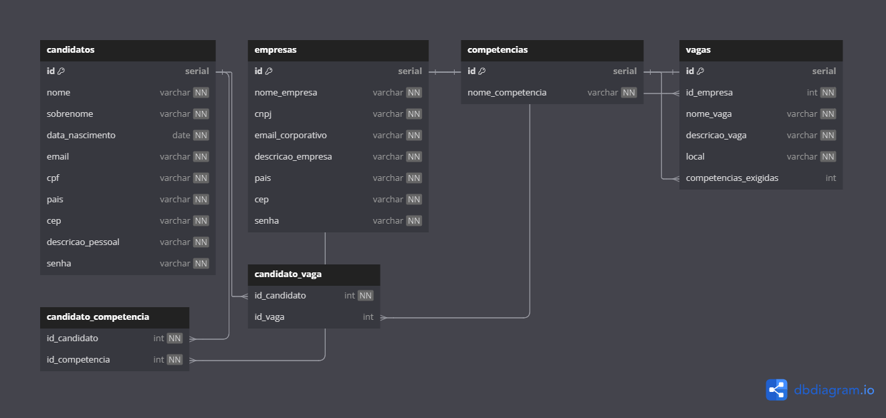

# Projeto criado por: Rodrigo Hora Silva (EM CONSTRUÇÃO)

## Projeto de um sistema de linketinder

### Tecnologias utilizadas no back-end:
- Groovy
- Grails
- Java
- DBDiagram.io

### Tecnologias utilizadas no front-end:
- TypeScript
- HTML
- CSS

