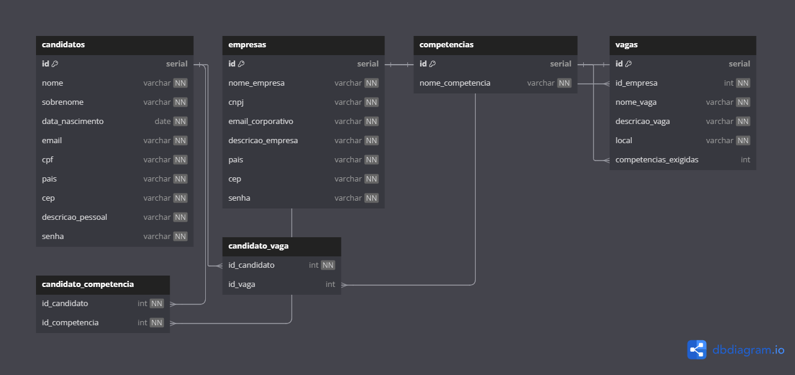

# Projeto criado por: Rodrigo Hora (EM CONSTRUÇÃO)

## Projeto de um sistema de linketinder

## Descrição do Projeto
### Sistema Linketinder
Este projeto é um sistema em desenvolvimento chamado Linketinder, criado por Rodrigo Hora. O sistema tem como objetivo fornecer uma plataforma para conectar candidatos com oportunidades de emprego.

### Tecnologias utilizadas no back-end:
- Groovy
- Grails
- Java
- DBDiagram.io
- PostgreSQL
- TomCat

</img>

### Tecnologias utilizadas no front-end:
- TypeScript
- HTML
- CSS

## Para configurar o TomCat no IntelliJ IDEA
1. Baixe e instale o Tomcat em `https://tomcat.apache.org/download-90.cgi` em ZIP
2. Extraia o arquivo ZIP em uma pasta de sua preferência
3. Abra o IntelliJ IDEA
4. Clique em `Run` no menu superior
5. Clique em `Edit Configurations`
6. Clique no botão `+` no canto superior esquerdo
7. Clique em `Tomcat Server` e depois em `Local`
8. Clique em `Fix` e selecione a pasta onde o Tomcat foi instalado
9. Clique em `Deployment` e depois em `+`
10. Selecione `Artifact` e depois `linketinder:war exploded`
11. Clique em `Apply` e depois em `OK`
12. Clique em `Run` no menu superior
13. Clique em `Run 'Tomcat'`
14. Acesse o sistema em `http://localhost:8080/`