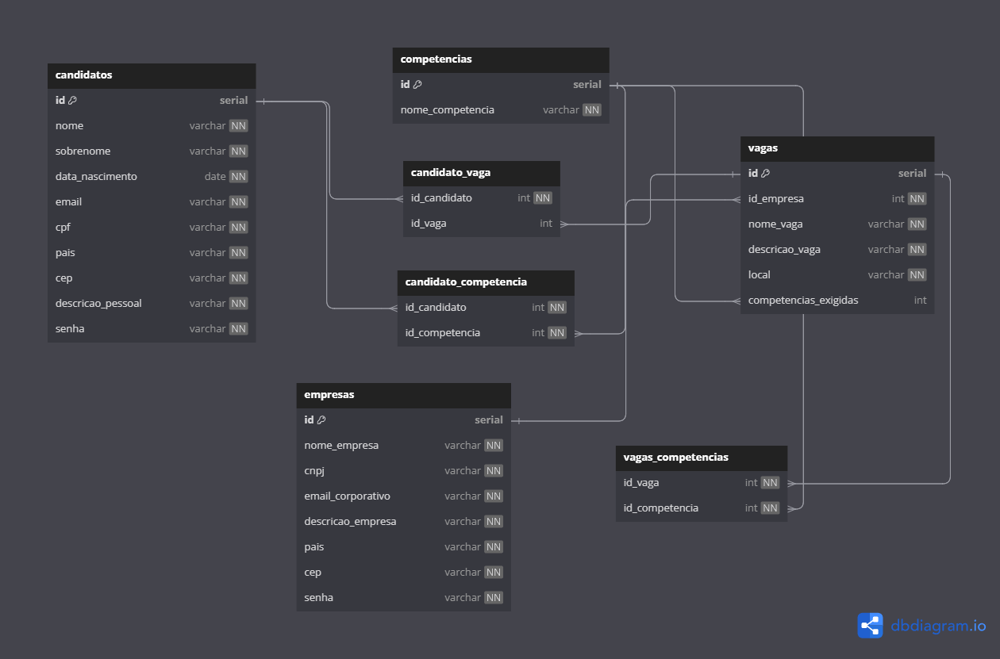

# Projeto criado por: Rodrigo Hora (EM CONSTRUÇÃO)

## Projeto de um sistema de linketinder

## Descrição do Projeto
### Sistema Linketinder
Este projeto é um sistema em desenvolvimento chamado Linketinder, criado por Rodrigo Hora. O sistema tem como objetivo fornecer uma plataforma para conectar candidatos com oportunidades de emprego.

### Tecnologias utilizadas no back-end:
- Groovy
- Grails
- Java
- DBDiagram.io
- PostgreSQL

</img>

### Tecnologias utilizadas no front-end:
- TypeScript
- HTML
- CSS

